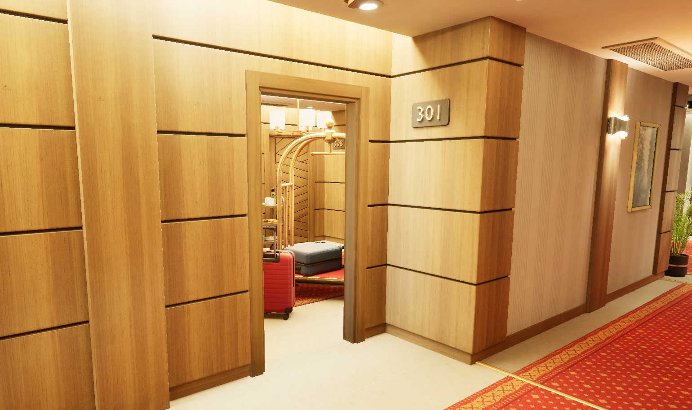
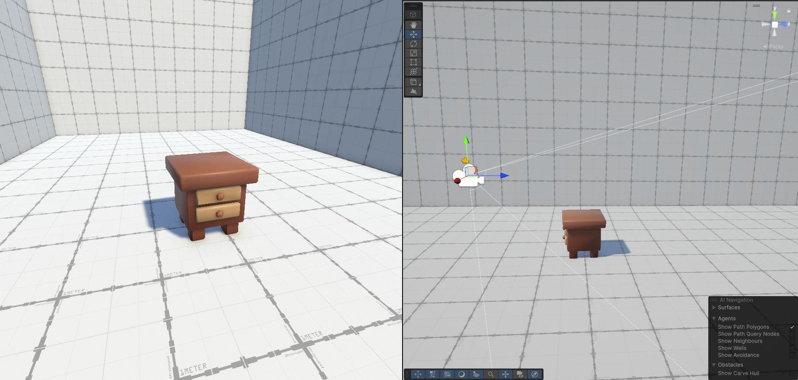
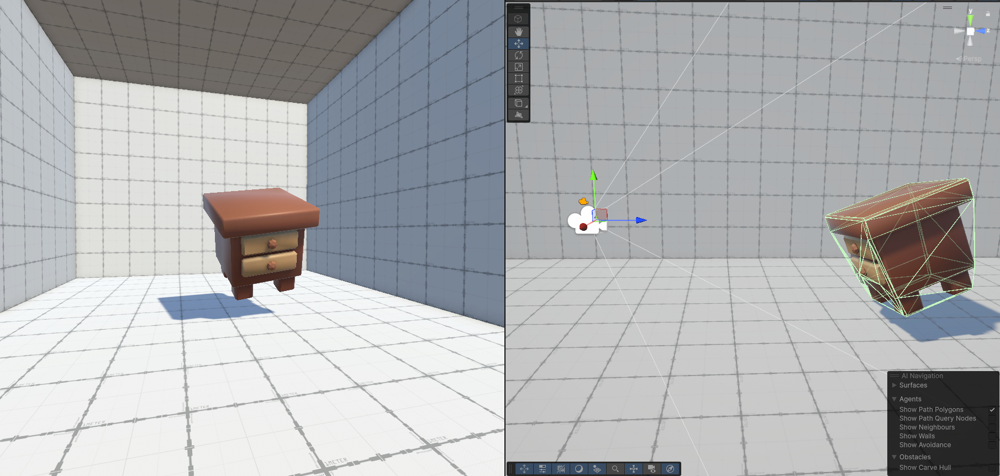

# Boundaries of Space and Perspective in Video Games

**Author:** Lukáš Olbrecht  

## About the Project
This project explores and implements two groundbreaking gameplay mechanics that challenge the conventional boundaries of space and perspective in video games:

1. **Seamless Portals**  
   Experience portals that allow smooth traversal between spaces, including dynamic resizing of the player and orientation adjustments. This mechanic is powered by *Unreal Engine*.

   

2. **Forced Perspective**  
   Inspired by the game *Superliminal*, this mechanic manipulates object size based on the player's perspective. It has been implemented using *Unity*.

   
   

By merging these technologies, the project demonstrates how creative use of space and perspective can enhance immersion and innovation in game design.

## Technologies Used
- **Unreal Engine**: For the creation of seamless portals.
- **Unity**: For implementing the forced perspective mechanic.

## Highlights
- **Seamless Immersion**: Walk through portals as if the world is one continuous space.
- **Perspective-Based Gameplay**: Redefine reality by manipulating objects based on how you see them.

## Purpose
This project serves as a showcase of how space and perspective can be reimagined in video games. It aims to inspire game developers and contribute to broader research in game mechanics.

## Contact
For inquiries or feedback, feel free to reach out to me via GitHub or other platforms.

## License
This project is intended for demonstration purposes only. Use of the content is permitted with the author's consent.